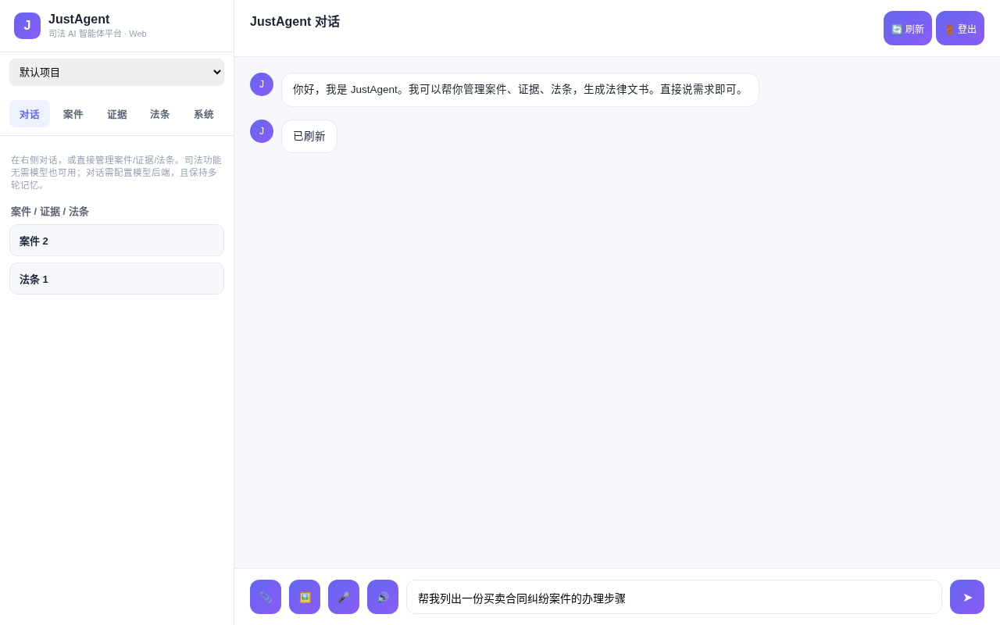
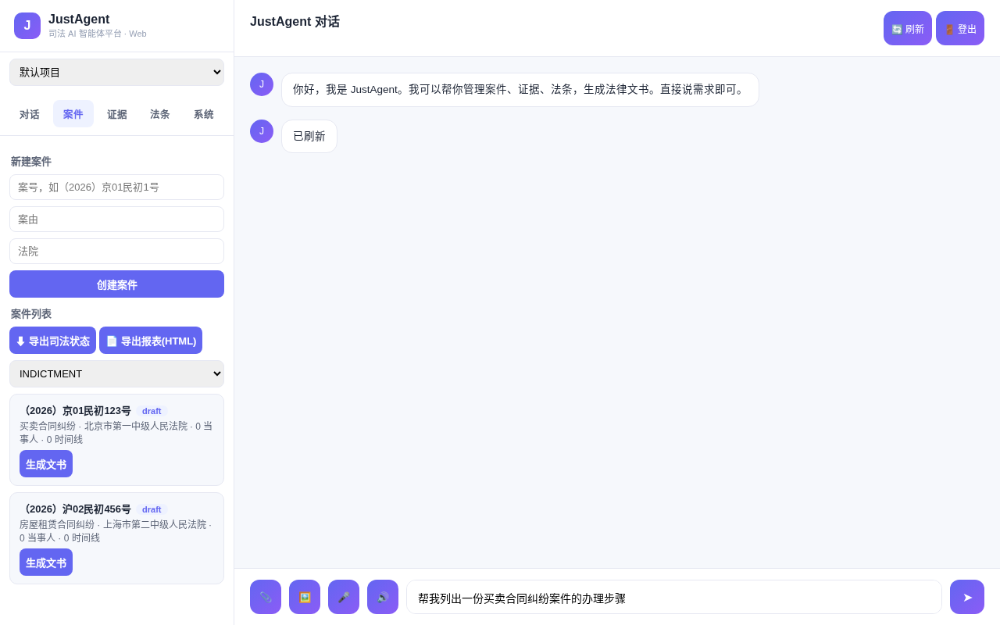
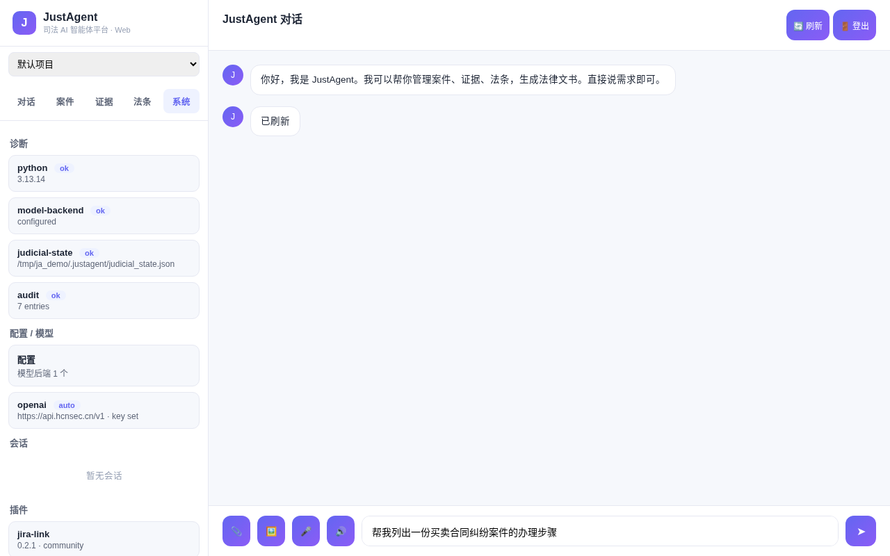

# ⚖️ JustAgent: Judicial AI Agent Platform

<p align="center">
  
</p>

<p align="center">
  <a href="https://gitcode.com/badhope/JustAgent"></a>
  <a href="https://github.com/weed33834/JustAgent"></a>
  <a href="LICENSE"></a>
  <a href="https://www.python.org/"></a>
  <a href="https://fastapi.tiangolo.com/"></a>
  
</p>

[English](README.md) | [中文](README.zh.md) | [日本語](README.ja.md)

> **Intelligence for Justice** — empowering judicial authorities with intelligent, auditable automation.

**Keywords**: judicial AI · legal-tech · AI agent · legal document generation · evidence review · case management · legal knowledge base (RAG) · multi-agent · CLI + Web console · LLM · FastAPI · Docker · 司法智能体 · 法律科技

JustAgent is a judicial AI agent platform that assists judicial organs and government departments by automating judicial workflows. It organizes case materials, reviews evidence, and generates legal documents through a multi-agent collaboration loop — with permission controls on every action and full audit persistence for every conversation.

## Screenshots & Demo

<p align="center">
  
  
  
  
  
</p>

<details><summary>▶ Watch the demo video</summary>
<p>
<video controls width="100%" src="assets/demo.mp4"></video>
</p>
</details>

## What it does

JustAgent is a judicial AI agent platform packaged as a single CLI tool. Built for judicial authorities and government departments, it runs an iterative tool-calling loop: the LLM reads case materials, proposes actions, executes them through tools, and verifies the results. Every destructive action passes through a permission engine, and every conversation can be saved and resumed — keeping the judicial process auditable and controllable.

Three modes are available:

1. **Agent mode** — interactive REPL or one-shot task. Plan first (read-only analysis of case files), then act (with permission prompts), or enable Yolo mode to auto-approve tool calls. Multi-turn conversations persist across sessions.
2. **Pipeline mode** — an optional `clean → verify → commit → upload` shortcut for judicial document release workflows.
3. **Project mode** — manage multiple case projects and run cross-project operations.

## Core features

| Feature | Description |
|---------|-------------|
| **Case Material Organization** | Ingest, classify, and summarize case files (dossiers, statements, exhibits). Extract entities, timelines, and relationships into a structured case map for rapid review. |
| **Evidence Review** | Cross-check evidence for consistency, completeness, and admissibility. Flag contradictions, gaps, and chain-of-custody issues with citations back to source material. |
| **Legal Document Generation** | Draft indictments, judgments, rulings, and other legal instruments from case context. Apply standardized templates with jurisdiction-aware formatting and clause libraries. |
| **Judicial Workflow Automation** | Orchestrate multi-step judicial procedures (filing → review → hearing → ruling). Coordinate specialized agents through the orchestration layer with full audit logging. |

## Architecture overview (multi-agent collaboration)

JustAgent coordinates specialized agents through an orchestration layer built on top of a shared knowledge base and a unified permission engine:

```
┌───────────────────────────────────────────────────────────┐
│                Orchestrator / Coordinator                 │
│        (workflow orchestration · decision routing · mesh)  │
└───────────┬───────────────┬───────────────┬───────────────┘
            │               │               │
            ▼               ▼               ▼
   ┌────────────────┐ ┌──────────────┐ ┌────────────────┐
   │   Case Material │ │   Evidence   │ │    Legal Doc   │
   │  Organization   │ │    Review    │ │  Generation    │
   │     Agent       │ │    Agent     │ │     Agent      │
   └────────┬────────┘ └──────┬───────┘ └───────┬────────┘
            │                 │                 │
            ▼                 ▼                 ▼
   ┌──────────────────────────────────────────────────────┐
   │  Knowledge Layer (RAG / vector / graph / document)   │
   │  Security Layer (RBAC / SSO / encryption / audit)    │
   │  Permission Engine · Checkpoints · Audit Log         │
   └──────────────────────────────────────────────────────┘
```

Specialized agents share a common knowledge layer (legal corpus, case repository, evidence store) and operate under a unified permission engine with full audit logging. Every agent action is checkpointed and reversible, so the judicial process stays transparent and defensible.

## Install

```bash
pip install justagent
```

AI-powered document generation, evidence analysis, and agent mode require the optional extras:

```bash
pip install "justagent[ai,security]"
```

Python 3.11 or later. Git 2.30+ recommended.

## Quick start

### Agent mode

```bash
cd your-case-project
justagent agent                    # interactive REPL (multi-turn chat)
justagent agent "review case A001 evidence"   # one-shot task
justagent agent --plan "..."       # plan first (read-only, no edits)
justagent agent --yolo "..."       # auto-approve all tool calls
justagent agent -i --resume <id>   # resume a saved session
justagent agent --json "..."       # NDJSON event stream for automation
```

### Pipeline mode (optional)

```bash
cd your-case-project
justagent init
justagent ship                     # clean → verify → commit → upload
```

Or run individual stages:

```bash
justagent clean
justagent verify
justagent commit
justagent upload
```

### Project mode

```bash
justagent project list             # list managed case projects
justagent project add ./case-2026-001
justagent project run case-2026-001 ship  # run a command in a managed project
```

## Web console

`justagent web` starts a browser console covering the full operational surface —
no CLI needed. Judicial features work without an LLM; chatting needs a
configured model backend.

```bash
justagent web                      # http://127.0.0.1:8000
justagent web --host 0.0.0.0 --port 8000   # expose on a network
```

Web capabilities:
- **Chat**: SSE streaming, multi-turn memory, tool calling (incl. the
  `judicial` tool). Voice input (mic) and TTS speak use the browser Web Speech
  API. **Image recognition** via `/api/vision` (OpenAI multimodal content
  blocks) — upload a picture and ask about it.
- **Judicial**: manage cases / evidence / legal knowledge / documents.
  **Project switching**: pick a managed project from the sidebar dropdown; all
  judicial operations then target that project's state
  (`X-JustAgent-Project` header → `<project>/.justagent/judicial_state.json`).
- **System**: knowledge RAG, config, models, metrics, audit, sessions,
  plugins, scheduled tasks (ECharts dashboard), diagnostics, notifications
  (webhook/email), file upload, printable report (`/api/report`).

Web backend endpoints (all under `/api`): `chat`, `chat/stream`, `vision`,
`state`, `system`, `doctor`, `config`, `models`, `metrics`, `audit`,
`sessions`, `plugins`, `schedule`, `knowledge/search`, `judicial/*`,
`notifications`, `upload`, `projects`, `auth/*`, `health`.

**Auth**: set `JUSTAGENT_WEB_TOKEN` to require `Authorization: Bearer <token>`
on `/api/*`.

### Docker deployment

```bash
docker build -t justagent-web .
docker run -p 8000:8000 \
  -e JUSTAGENT_WEB_TOKEN=<token> \
  -e OPENAI_API_KEY=<key> \
  justagent-web
```

Environment variables: `JUSTAGENT_WEB_TOKEN`, `JUSTAGENT_WEB_HOST`,
`JUSTAGENT_WEB_PORT` (see `.env.example`).

## Configuration

JustAgent reads `.justagent.toml` from the project root:

```toml
[clean]
enabled = true
tools = ["ruff"]

[commit]
enabled = true
conventional_commits = true

[[model.backends]]
provider = "openai"
base_url = "https://api.openai.com/v1"
api_key = "${OPENAI_API_KEY}"
model = "gpt-4o-mini"

[security]
enabled = true
tools = ["semgrep"]
threshold = "medium"
```

Environment variables in config values (`${VAR}`) are expanded at runtime. See `.justagent.toml.example` for the full set of options, including judicial scenario examples.

## AI backends

JustAgent routes LLM calls through the official [OpenAI SDK](https://github.com/openai/openai-python). Every supported provider — OpenAI, Ollama, OpenRouter, Azure, vLLM, LM Studio, llama.cpp — exposes an OpenAI-compatible endpoint, so a single client with a per-provider base URL covers them all without extra configuration. For sensitive judicial data, self-hosted backends (Ollama, vLLM, llama.cpp) keep data on-premises.

Configure one or more backends in `.justagent.toml`:

```toml
[[model.backends]]
provider = "ollama"
base_url = "http://localhost:11434"
model = "llama3.2"

[[model.backends]]
provider = "openrouter"
api_key = "${OPENROUTER_API_KEY}"
model = "anthropic/claude-sonnet-4"
```

The gateway handles retry, rate limiting, and automatic failover across providers.

## Feature modules

Agent mode is built on an iterative tool-calling loop with safety controls:

| Module | Description |
|---|---|
| **Plan/Act modes** | Plan mode is read-only analysis; Act mode executes changes with permission prompts. Switch with `--plan` / `--yolo` or `/mode` in the REPL. |
| **Tool calling** | Built-in tools: `read_file`, `write_to_file`, `replace_in_file`, `apply_patch`, `run_command`, `search`, `web_fetch`, `ask_question`. Plus MCP tools. |
| **Session persistence** | Conversations saved to `~/.justagent/sessions/`. Resume with `--resume <id>`. Slash commands: `/tokens`, `/history`, `/diff`. |
| **Permissions** | `allow` / `deny` / `ask` rules with `once` / `always` scope and wildcard patterns. Wired into `write_to_file`, `replace_in_file`, `apply_patch`, `run_command`. |
| **Change tracking** | Tracks every file created/modified/deleted during a run, with line-count deltas. Shows a summary table at the end. |
| **Checkpoints** | Shadow git snapshots after every tool call. Restore files, conversation, or both. |
| **Compaction** | Auto-compact long conversations at 90% context budget. Basic (truncate) or agentic (LLM summary) modes. |
| **Loop detection** | Detect repeated tool calls (soft=3, hard=5) and break out of repetitive loops. |
| **Mistake tracker** | Count consecutive errors, stop or continue based on config. |
| **Repo map** | Regex-based symbol extraction (Python/JS/TS/Rust/Go) formatted as a compact tree. |
| **Skills** | Load `SKILL.md` files from `.justagent/skills/` with progressive disclosure. |
| **Subagents** | Spawn read-only parallel research subagents with isolated context. |
| **MCP** | Connect Model Context Protocol servers (stdio / SSE / HTTP) with OAuth support. |
| **Knowledge layer** | Document processing, ETL, knowledge graph, RAG, and vector storage for case corpora and legal references. |
| **Orchestration** | Coordinator, decision routing, agent mesh, and workflow engine for multi-agent collaboration. |
| **Security & compliance** | RBAC, SSO, encryption, data protection, and compliance checks tailored for judicial and government use. |

### Slash commands (in interactive REPL)

| Command | Description |
|---------|-------------|
| `/help` | Show available commands |
| `/mode <act\|plan\|yolo>` | Switch agent mode |
| `/tokens` | Show token usage breakdown |
| `/history` | Show conversation history |
| `/diff` | Show git diff |
| `/lint` | Run linter |
| `/test` | Run tests |
| `/add <path>` | Add file to context |
| `/drop <path>` | Drop file from context |
| `/clear` | Clear conversation |
| `/exit` | Exit REPL |

## Commands

| Command | Description |
|---------|-------------|
| `justagent agent` | Interactive AI agent (REPL or one-shot) |
| `justagent session` | Manage saved sessions (list / show / resume / delete) |
| `justagent project` | Manage multiple local case projects |
| `justagent init` | Initialize in the current directory |
| `justagent clean` | Format and lint source files |
| `justagent verify` | Run test suite and checks |
| `justagent commit` | Generate and create a commit |
| `justagent upload` | Build and publish artifacts |
| `justagent ship` | Run clean, verify, commit, upload in sequence |
| `justagent fix` | AI-powered code fix suggestions |
| `justagent config` | View and manage configuration |
| `justagent doctor` | Diagnose environment and dependencies |
| `justagent plugin` | Manage plugins |
| `justagent hooks` | Manage lifecycle hooks |
| `justagent lsp` | Language Server Protocol integration |
| `justagent artifacts` | Manage build artifacts |
| `justagent metrics` | Show usage and cost metrics |

## Development

```bash
git clone https://gitcode.com/badhope/justagent.git
cd justagent
uv sync --all-extras
```

Test, lint, type-check:

```bash
uv run pytest tests/ -v
uv run ruff check src/ tests/
uv run mypy src/
```

## Tech stack

| Layer | Component |
|-------|-----------|
| CLI framework | Typer |
| Plugin system | Pluggy |
| AI gateway | LiteLLM |
| Agent loop | Custom (tool-calling iteration with safety controls) |
| Multi-agent orchestration | Coordinator / mesh / workflow / decision |
| Knowledge layer | RAG · vector · knowledge graph · document ETL |
| Config / schema | Pydantic v2 + pydantic-settings |
| Terminal output | Rich |
| Logging | Structlog (Rich console + JSON file) |
| LSP server | pygls |
| Cache | diskcache |
| Metrics | prometheus-client |
| HTTP client | httpx |
| Lint / format | Ruff |
| Security scan | Semgrep |
| Security & compliance | RBAC · SSO · encryption · data protection |
| MCP | Official `mcp` Python SDK |

## Architecture

```
src/justagent/
├── cli/                 # Typer commands
│   ├── commands/        # One module per command (agent, session, project, ...)
│   ├── display.py       # Rich-based terminal output (spinners, panels, diff)
│   └── main.py          # Entry point + global options
├── agent/               # Agent core
│   ├── runtime.py       # Iterative tool-calling loop (run / continue_run / reset)
│   ├── tools/           # Built-in tool definitions + executors
│   │   ├── base.py      # Tool, ToolContext, ToolResult, request_permission()
│   │   ├── registry.py  # Tool registration
│   │   └── builtin/     # read_file, write_to_file, replace_in_file, apply_patch,
│   │                    # run_command, search, web_fetch, ask_question
│   ├── plan_act.py      # Plan/Act/Yolo mode system prompt + tool filtering
│   ├── session.py       # Session persistence (save / resume / serialize)
│   ├── slash_commands.py # /help /mode /tokens /history /diff /lint /test ...
│   ├── change_tracker.py # File change tracking with line-count deltas
│   ├── loop_detection.py # Repeated-tool-call loop detection
│   ├── mistake_tracker.py # Consecutive error tracking
│   ├── compaction.py    # Context compaction (basic + agentic)
│   ├── subagent.py      # Read-only parallel research subagents
│   └── mcp_client.py    # Model Context Protocol client
├── checkpoint/          # Shadow git snapshots
├── context/             # Context engineering
│   ├── skill.py         # SKILL.md loader
│   └── repo_map.py      # Regex-based repo symbol map
├── orchestration/       # Multi-agent collaboration
│   ├── coordinator.py   # Agent coordination
│   ├── decision.py      # Decision routing
│   ├── mesh.py         # Agent mesh
│   └── workflow.py     # Judicial workflow orchestration
├── knowledge/           # Judicial knowledge layer
│   ├── rag.py          # Retrieval-augmented generation
│   ├── vector.py       # Vector storage
│   ├── graph.py        # Knowledge graph
│   ├── document.py     # Document processing
│   └── etl.py          # Extract / transform / load
├── communication/      # Inter-agent & team communication
│   ├── audit.py        # Audit trail
│   ├── broadcast.py    # Broadcast
│   ├── meeting.py      # Meeting / hearing coordination
│   ├── messaging.py    # Messaging
│   └── notification.py # Notifications
├── security/           # Judicial-grade security
│   ├── rbac.py         # Role-based access control
│   ├── sso.py          # Single sign-on
│   ├── encryption.py   # Encryption
│   ├── data_protection.py # Data protection
│   └── compliance.py   # Compliance checks
├── permissions/         # Tool permission engine (allow / deny / ask rules)
├── adapters/            # External integrations
│   ├── providers/       # LLM providers via unified gateway
│   ├── upload/          # PyPI / Docker / GitHub uploaders
│   ├── git_adapter.py
│   ├── model_gateway.py
│   └── tool_adapter.py
├── core/                # Core infrastructure
│   ├── config_center.py
│   ├── audit_logger.py
│   ├── hook_dispatcher.py
│   ├── plugin_registry.py
│   ├── batch_ops.py     # Cross-project batch operations
│   ├── sandbox.py
│   ├── cache.py
│   └── ...
├── plugins/             # Built-in plugins (security_scan, typecheck, docker_ship, ...)
├── models/              # Pydantic config schemas
├── utils/               # Shared utilities
└── registry/            # Plugin registry index
```

## Mirrors

- [GitCode](https://gitcode.com/badhope/justagent) — faster clone for users in mainland China

## License

Apache-2.0 — see [LICENSE](LICENSE).
